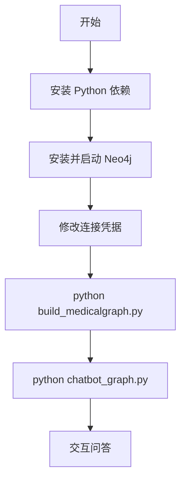

# QASystemOnMedicalKG 启动项目指南

> 本文档提供从零到跑通医疗知识图谱问答系统的完整操作步骤。架构与模块说明请参阅 [项目分析.md](./项目分析.md)。

---

## 启动流程总览

项目正常运行需要两个前置条件：**Neo4j 图谱已导入** + **Python 依赖已安装**。仓库已自带 `data/medical.json` 和 `dict/` 词典，默认走「快速启动」路径。



---

## 1. 前置条件

| 组件 | 是否必需 | 说明 |
|------|----------|------|
| Python 3 | 必需 | 建议 3.8 及以上 |
| Neo4j | 必需 | 知识图谱存储，建图与问答均依赖 |
| py2neo + pyahocorasick | 必需 | 项目无 requirements.txt，需手动安装 |
| MongoDB + pymongo + lxml | 可选 | 仅从零爬取数据时需要 |

**工作目录**：以下所有命令均在 `QASystemOnMedicalKG/` 目录下执行。

```bash
cd QASystemOnMedicalKG
```

---

## 2. 环境准备

### 2.1 创建虚拟环境（推荐）

```bash
python -m venv .venv
source .venv/bin/activate        # macOS / Linux
# .venv\Scripts\activate         # Windows
```

### 2.2 安装 Python 依赖

```bash
pip install py2neo pyahocorasick
```

验证安装：

```bash
python -c "import py2neo; import ahocorasick; print('依赖安装成功')"
```

### 2.3 版本兼容说明

项目原始代码基于 **Python 3.6 + py2neo 旧版 API**，连接写法如下：

```python
Graph(host="127.0.0.1", http_port=7474, user="lhy", password="lhy123")
```

若安装最新版 py2neo 后连接报错，请参考 [第 8 节 常见问题排查](#8-常见问题排查) 中的兼容方案。

---

## 3. 安装并配置 Neo4j

### 3.1 安装 Neo4j

**方式一：Neo4j Desktop（推荐新手）**

1. 前往 [Neo4j 下载页](https://neo4j.com/download/) 安装 Neo4j Desktop
2. 新建 Local DBMS，设置用户名和密码
3. 启动数据库，确认状态为 Running

**方式二：Docker**

```bash
docker run -d \
  --name neo4j-medical \
  -p 7474:7474 -p 7687:7687 \
  -e NEO4J_AUTH=lhy/lhy123 \
  neo4j:3.5
```

> 建议使用 Neo4j 3.5 版本，与项目 py2neo 旧 API 兼容性最好。

### 3.2 确认端口

代码硬编码 HTTP 端口 **7474**，请确保 Neo4j 的 HTTP 接口可访问：

- 浏览器打开 `http://localhost:7474`，能进入 Neo4j Browser 即表示正常

### 3.3 修改连接凭据

将 Neo4j 的用户名和密码同步写入以下两个文件（两处必须一致）：

| 文件 | 位置 |
|------|------|
| `answer_search.py` | 第 11-15 行 |
| `build_medicalgraph.py` | 第 15-19 行 |

修改示例（将用户名/密码改为你实际设置的值）：

```python
self.g = Graph(
    host="127.0.0.1",
    http_port=7474,
    user="lhy",        # 改为你的用户名
    password="lhy123") # 改为你的密码
```

---

## 4. 导入知识图谱（首次必须）

### 4.1 执行导入

确保 Neo4j 已启动且凭据已配置，然后运行：

```bash
python build_medicalgraph.py
```

### 4.2 导入过程说明

- **数据源**：`data/medical.json`（8808 条疾病 JSON 记录）
- **执行步骤**：
  1. `create_graphnodes()` — 创建 7 类节点（Disease 含属性，其余仅 name）
  2. `create_graphrels()` — 创建 11 类关系边
- **预计耗时**：数小时（终端会持续打印进度计数）
- **仅需执行一次**：重复导入可能产生重复节点

> 如需重新导入，请先在 Neo4j Browser 中清空数据库：`MATCH (n) DETACH DELETE n`

### 4.3 验证导入结果

在 Neo4j Browser（`http://localhost:7474`）中执行：

```cypher
MATCH (n) RETURN count(n)
```

预期结果：约 **44,111** 个节点。

查看关系数量：

```cypher
MATCH ()-[r]->() RETURN count(r)
```

预期结果：约 **294,149** 条关系。

---

## 5. 启动问答系统

### 5.1 启动命令

```bash
python chatbot_graph.py
```

> **注意**：README 中写的是 `python chat_graph.py`，实际入口文件名为 `chatbot_graph.py`。

### 5.2 启动过程

1. 程序加载 `dict/` 下 8 个词典文件，构建 Aho-Corasick 自动机
2. 终端打印 `model init finished ......` 表示初始化完成
3. 出现 `用户:` 提示符，等待输入问题

### 5.3 交互示例

```
用户:乳腺癌的症状有哪些？
小勇: 乳腺癌的症状包括：乳腺癌的远处转移；胸痛；乳头溢液；...

用户:板蓝根颗粒能治啥病
小勇: 板蓝根颗粒主治的疾病有流行性腮腺炎；喉痹；...,可以试试
```

### 5.4 退出

按 `Ctrl+C` 或 `Ctrl+D` 退出程序。

---

## 6. 验证清单

启动成功后，用以下问句验证各功能是否正常：

| 测试问句 | 预期意图类型 | 预期行为 |
|----------|-------------|----------|
| 糖尿病有什么症状 | disease_symptom | 返回糖尿病的症状列表 |
| 板蓝根颗粒能治啥病 | drug_disease | 返回该药品可治疗的疾病 |
| 失眠的人不要吃啥 | disease_not_food | 返回忌吃食物列表 |
| 怎样才能预防肾虚 | disease_prevent | 返回预防措施 |
| 糖尿病 | disease_desc | 返回疾病描述 |

**异常判断**：若所有问题均返回以下兜底文案，说明图谱或连接有问题：

> 您好，我是小勇医药智能助理，希望可以帮到您。如果没答上来，可联系https://liuhuanyong.github.io/。祝您身体棒棒！

排查方向：Neo4j 未启动 / 凭据错误 / 图谱未导入 / dict 与图谱实体名不一致。

---

## 7. 可选：从零构建数据（高级）

仓库已包含 `data/medical.json` 和 `dict/`，**绝大多数场景无需此步骤**。仅当需要重新采集原始数据时参考：

```bash
# 1. 安装额外依赖
pip install pymongo lxml

# 2. 启动 MongoDB

# 3. 爬取数据（目标站点可能已变更，不保证可用）
python prepare_data/data_spider.py

# 4. 清洗数据（依赖缺失的 first_name.txt，可能无法直接运行）
python prepare_data/build_data.py

# 5. 导出 medical.json 后，继续第 4 节导入流程
python build_medicalgraph.py
python chatbot_graph.py
```

**已知限制**：

- `prepare_data/build_data.py` 依赖 `first_name.txt`，仓库中未包含
- 爬虫目标站点（寻医问药 xywy.com）页面结构可能已变更
- 不推荐作为默认启动路径

---

## 8. 常见问题排查

| 现象 | 可能原因 | 处理方法 |
|------|----------|----------|
| `ModuleNotFoundError: No module named 'py2neo'` | Python 依赖未安装 | `pip install py2neo pyahocorasick` |
| `ModuleNotFoundError: No module named 'ahocorasick'` | pyahocorasick 未安装 | `pip install pyahocorasick` |
| Neo4j 连接失败 / Connection refused | 数据库未启动或端口不对 | 确认 Neo4j 状态为 Running，HTTP 端口为 7474 |
| Authentication failed | 用户名或密码不匹配 | 同步修改 `answer_search.py` 和 `build_medicalgraph.py` 中的凭据 |
| py2neo API 报错（如 `Graph()` 参数不识别） | 新版 py2neo 不兼容旧连接写法 | 尝试 `pip install py2neo==4.3.0`，或使用 Neo4j 3.5 |
| 所有问题返回兜底回复 | 图谱为空或未导入 | 确认 `build_medicalgraph.py` 已完整执行；在 Neo4j Browser 检查节点数量 |
| 识别不到实体 | dict 词典与图谱实体名不一致 | 确认 `dict/` 目录完整；可通过 `build_medicalgraph.py` 的 `export_data()` 重新导出 |
| 启动后打印 `model init finished` 后无反应 | 正常现象 | 在 `用户:` 提示符后输入问题并回车 |
| `build_medicalgraph.py` 运行极慢 | 正常现象 | 8808 条记录 + 30 万关系，预计数小时，耐心等待 |

### py2neo 版本兼容参考

```bash
# 方案 A：使用 py2neo 4.x + Neo4j 3.5（推荐）
pip install py2neo==4.3.0

# 方案 B：若已安装 Neo4j 4.x/5.x，需改用新版连接方式
# 将 Graph(host=, http_port=, user=, password=) 改为：
# Graph("bolt://localhost:7687", auth=("用户名", "密码"))
# 需同时修改 answer_search.py 和 build_medicalgraph.py
```

---

## 9. 快速启动命令汇总

适用于已完成 Neo4j 配置和图谱导入的环境，日常启动只需：

```bash
cd QASystemOnMedicalKG
source .venv/bin/activate    # 若使用了虚拟环境
python chatbot_graph.py
```

首次完整部署：

```bash
cd QASystemOnMedicalKG
python -m venv .venv && source .venv/bin/activate
pip install py2neo pyahocorasick
# 安装并启动 Neo4j，修改 answer_search.py 和 build_medicalgraph.py 中的凭据
python build_medicalgraph.py   # 首次导入，耗时数小时
python chatbot_graph.py        # 启动问答
```

---

## 10. 相关文档

| 文档 | 说明 |
|------|------|
| [doc/项目分析.md](./项目分析.md) | 架构、模块依赖、请求流程、知识图谱 Schema |
| [README.md](../README.md) | 项目原始介绍与问答示例 |
