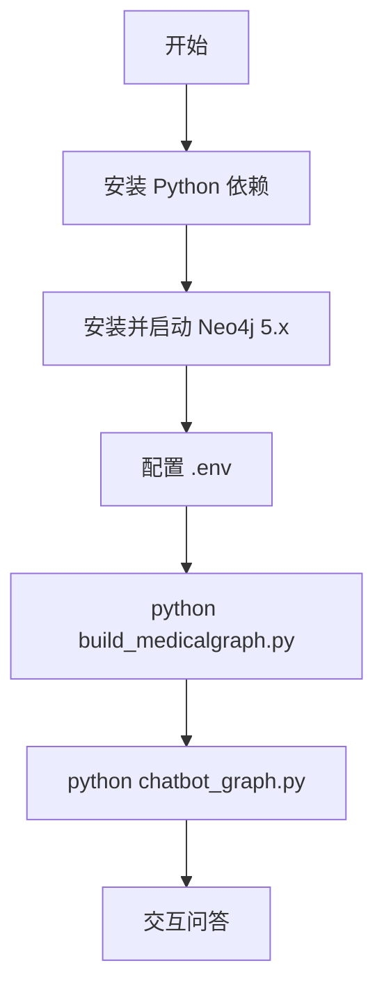

# QASystemOnMedicalKG 启动项目指南

> 本文档提供从零到跑通医疗知识图谱问答系统的完整操作步骤。架构与模块说明请参阅 [项目分析.md](./项目分析.md)，升级说明请参阅 [项目升级.md](./项目升级.md)。

---

## 启动流程总览

项目正常运行需要两个前置条件：**Neo4j 图谱已导入** + **Python 依赖已安装**。仓库已自带 `data/medical.json` 和 `dict/` 词典。



---

## 1. 前置条件

| 组件 | 是否必需 | 说明 |
|------|----------|------|
| Python 3.11+ | 必需 | 推荐 3.11 |
| Neo4j 5.x | 必需 | Bolt 协议，端口 7687 |
| neo4j + pyahocorasick + python-dotenv | 必需 | 见 `requirements.txt` |
| MongoDB + pymongo + lxml | 可选 | 仅从零爬取数据时需要 |

**工作目录**：以下所有命令均在 `QASystemOnMedicalKG/` 目录下执行。

```bash
cd QASystemOnMedicalKG
```

---

## 2. 环境准备

### 2.1 创建虚拟环境（推荐）

```bash
python -m venv .venv
source .venv/bin/activate        # macOS / Linux
# .venv\Scripts\activate         # Windows
```

### 2.2 安装 Python 依赖

```bash
pip install -r requirements.txt
```

验证安装：

```bash
python -c "import neo4j; import ahocorasick; print('依赖安装成功')"
```

### 2.3 配置环境变量

```bash
cp .env.example .env
```

编辑 `.env`，填写 Neo4j 连接信息：

```env
NEO4J_URI=bolt://localhost:7687
NEO4J_USER=neo4j
NEO4J_PASSWORD=your_password_here
```

> 凭据通过 [`config.py`](../config.py) 加载，**不要**提交 `.env` 到 Git（已在 `.gitignore` 中忽略）。

---

## 3. 安装并配置 Neo4j

### 3.1 安装 Neo4j

**方式一：Neo4j Desktop（推荐）**

1. 前往 [Neo4j 下载页](https://neo4j.com/download/) 安装 Neo4j Desktop
2. 新建 Local DBMS（建议 Neo4j 5.x），设置密码
3. 启动数据库，确认状态为 Running

**方式二：Docker**

```bash
docker run -d \
  --name neo4j-medical \
  -p 7474:7474 -p 7687:7687 \
  -e NEO4J_AUTH=neo4j/your_password_here \
  neo4j:5
```

### 3.2 确认连接

- Bolt 端口 **7687** 可访问（应用连接使用此端口）
- 浏览器可打开 `http://localhost:7474` 进入 Neo4j Browser

### 3.3 配置说明

连接配置统一在 `.env` 中管理，由以下模块读取：

| 模块 | 用途 |
|------|------|
| `config.py` | 加载环境变量 |
| `graph/client.py` | 创建 Neo4j 官方驱动连接 |
| `graph/repository.py` | 问答查询 |
| `graph/importer.py` | 图谱批量导入 |

---

## 4. 导入知识图谱（首次必须）

### 4.1 执行导入

确保 Neo4j 已启动且 `.env` 已配置：

```bash
python build_medicalgraph.py
```

### 4.2 导入过程说明

- **数据源**：`data/medical.json`（8808 条疾病 JSON 记录）
- **实现**：`graph/importer.py` 使用 UNWIND 批量 MERGE
- **预计耗时**：约 **10–30 分钟**（较旧版逐条导入大幅缩短）
- **仅需执行一次**：重复导入可能产生重复关系

> 重新导入前清空数据库：`MATCH (n) DETACH DELETE n`

### 4.3 验证导入结果

```cypher
MATCH (n) RETURN count(n)
```

预期：约 **44,111** 个节点。

```cypher
MATCH ()-[r]->() RETURN count(r)
```

预期：约 **294,149** 条关系。

---

## 5. 启动问答系统

### 5.1 启动命令

```bash
python chatbot_graph.py
```

### 5.2 启动过程

1. 加载 `dict/` 词典，构建 Aho-Corasick 自动机
2. 终端打印 `model init finished ......`
3. 出现 `用户:` 提示符，输入问题

### 5.3 交互示例

```
用户:乳腺癌的症状有哪些？
小勇: 乳腺癌的症状包括：...

用户:板蓝根颗粒能治啥病
小勇: 板蓝根颗粒主治的疾病有...,可以试试
```

### 5.4 退出

按 `Ctrl+C` 或 `Ctrl+D` 退出。

---

## 6. 验证清单

| 测试问句 | 预期意图类型 | 预期行为 |
|----------|-------------|----------|
| 糖尿病有什么症状 | disease_symptom | 返回症状列表 |
| 板蓝根颗粒能治啥病 | drug_disease | 返回可治疗的疾病 |
| 失眠的人不要吃啥 | disease_not_food | 返回忌吃食物 |
| 怎样才能预防肾虚 | disease_prevent | 返回预防措施 |
| 糖尿病 | disease_desc | 返回疾病描述 |

若全部返回兜底文案，排查：Neo4j 未启动 / `.env` 凭据错误 / 图谱未导入。

---

## 7. 可选：从零构建数据（高级）

仓库已包含 `data/medical.json` 和 `dict/`，绝大多数场景无需此步骤。

---

## 8. 常见问题排查

| 现象 | 可能原因 | 处理方法 |
|------|----------|----------|
| `ModuleNotFoundError: neo4j` | 依赖未装 | `pip install -r requirements.txt` |
| `ServiceUnavailable` / Connection refused | Neo4j 未启动 | 确认数据库 Running，URI 为 `bolt://localhost:7687` |
| `AuthError` | 密码不匹配 | 检查 `.env` 中 `NEO4J_USER` / `NEO4J_PASSWORD` |
| 所有问题返回兜底回复 | 图谱为空 | 运行 `build_medicalgraph.py` 并验证节点数量 |
| 导入时报 `MATCH ... not found` | 节点未先创建 | 先完成 `create_graphnodes` 再建关系（脚本已按序执行） |

---

## 9. 快速启动命令汇总

日常启动：

```bash
cd QASystemOnMedicalKG
source .venv/bin/activate
python chatbot_graph.py
```

首次完整部署：

```bash
cd QASystemOnMedicalKG
python -m venv .venv && source .venv/bin/activate
pip install -r requirements.txt
cp .env.example .env   # 编辑 Neo4j 凭据
# 安装并启动 Neo4j 5.x
python build_medicalgraph.py
python chatbot_graph.py
```

---

## 10. 相关文档

| 文档 | 说明 |
|------|------|
| [doc/项目分析.md](./项目分析.md) | 架构、模块依赖、请求流程 |
| [doc/项目升级.md](./项目升级.md) | 现代化升级评估与重构说明 |
| [README.md](../README.md) | 项目原始介绍 |
