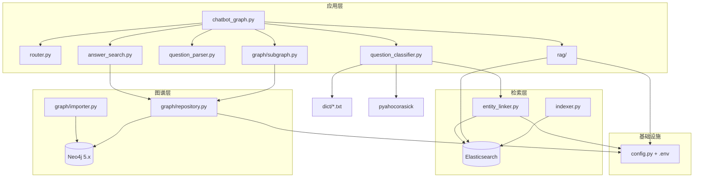
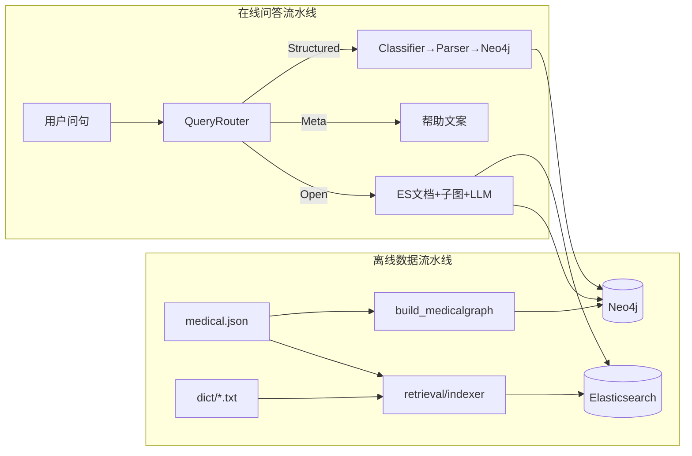
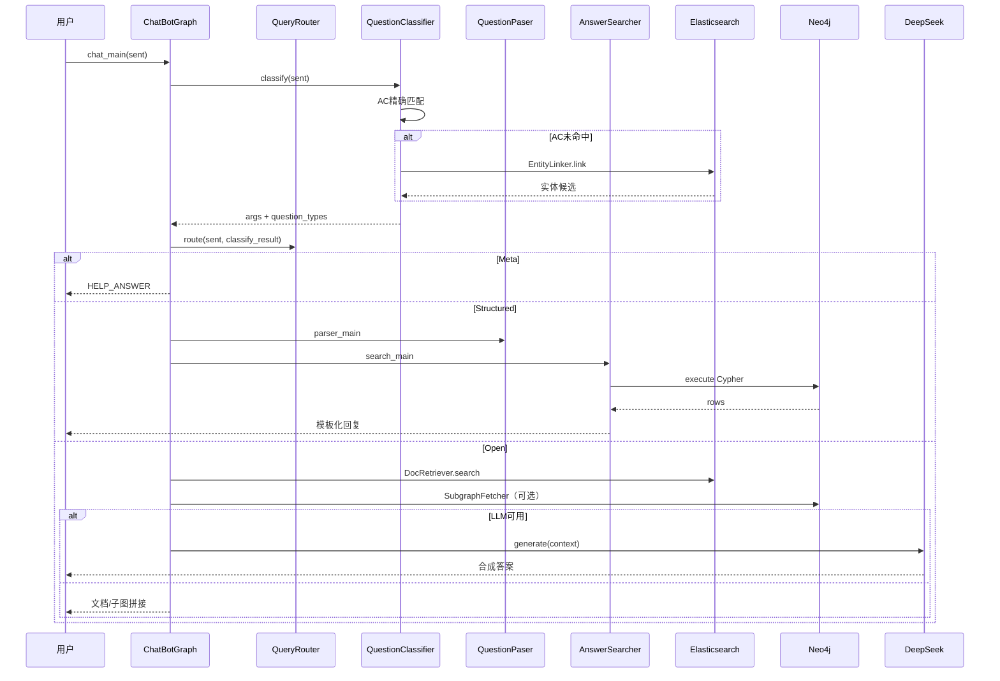

# QASystemOnMedicalKG 项目分析

> 本文档对医疗知识图谱问答系统进行结构化分析，涵盖目录结构、模块依赖、整体架构、请求流程、知识图谱 Schema、部署路径及已知局限。  
> 操作步骤见 [启动项目.md](./启动项目.md)；升级背景见 [项目升级.md](./项目升级.md)。

---

## 1. 项目概述

### 1.1 项目目标

本项目（**QASystemOnMedicalKG**）源自刘焕勇的 [QABasedOnMedicalKnowledgeGraph](https://github.com/liuhuanyong/QABasedOnMedicalKnowledgeGraph)，目标是从零搭建一个**以疾病为中心**的医药领域知识图谱，并基于该图谱提供自动问答服务。

- **知识图谱规模**：约 4.4 万实体、30 万关系
- **结构化问答**：18 类医疗问句 → Neo4j Cypher → 模板化回复
- **增强能力**：Elasticsearch 实体链接（错别字/别名）、RAG 文档问答、GraphRAG 子图增强（可选 LLM）
- **数据来源**：垂直医药网站（寻医问药 xywy.com）结构化数据

### 1.2 技术栈

| 组件 | 技术 | 用途 |
|------|------|------|
| 语言 | Python 3.11+ | 全部业务逻辑 |
| 图数据库 | Neo4j 5.x + 官方 `neo4j` 驱动 | 知识图谱存储与 Cypher 查询 |
| 检索引擎 | Elasticsearch 8.x + IK 分词 | 实体链接、文档 BM25 召回 |
| 实体识别 | pyahocorasick + ES `EntityLinker` | AC 精确匹配优先，ES/模糊匹配补充 |
| LLM | DeepSeek（OpenAI 兼容 API） | 开放问句 RAG 答案生成 |
| 配置 | `.env` + `config.py` + `python-dotenv` | 凭据与连接外置 |
| 文档数据库 | MongoDB + pymongo | 数据准备阶段（爬虫/清洗，可选） |

### 1.3 入口脚本

| 脚本 | 命令 | 说明 |
|------|------|------|
| `chatbot_graph.py` | `python chatbot_graph.py` | **在线问答入口**（交互式 CLI） |
| `build_medicalgraph.py` | `python build_medicalgraph.py` | **知识图谱入库**（离线，约 10–30 分钟） |
| `retrieval/indexer.py` | `python -m retrieval.indexer` | **ES 索引构建**（实体 + 文档块） |
| `scripts/eval_entity_recall.py` | `python scripts/eval_entity_recall.py` | 实体召回评测 |

---

## 2. 目录结构

```
QASystemOnMedicalKG/
├── chatbot_graph.py          # 问答入口：路由 + 三路径编排
├── router.py                 # QueryRouter：Structured / Meta / Open
├── question_classifier.py    # 实体识别 + 18 类意图分类
├── question_parser.py        # question_type → 参数化 Cypher
├── answer_search.py          # Neo4j 查询 + 答案模板渲染
├── build_medicalgraph.py     # 建图 CLI（逻辑在 graph/importer.py）
├── config.py                 # 读取 .env 配置
├── docker-compose.yml        # Elasticsearch（IK）容器
├── graph/                    # Neo4j 访问层
│   ├── client.py             # 驱动单例
│   ├── repository.py         # 执行 Cypher
│   ├── models.py             # CypherQuery、AnswerContext
│   ├── importer.py           # UNWIND 批量建图
│   └── subgraph.py           # GraphRAG 一跳子图
├── retrieval/                # Elasticsearch 检索层
│   ├── es_client.py
│   ├── indexer.py            # 离线索引 medical_entity / medical_doc
│   └── entity_linker.py      # 实体链接（ES + 字形模糊）
├── rag/                      # RAG 层
│   ├── retriever.py          # 文档 BM25 召回
│   └── generator.py          # DeepSeek LLM 生成
├── data/
│   ├── medical.json          # 核心数据源（8808 条）
│   └── eval_entity_cases.json # 实体召回评测集
├── dict/                     # 实体词典（AC + ES 索引源）
├── scripts/
│   └── eval_entity_recall.py
├── prepare_data/             # 可选：从零构建数据
└── doc/
    ├── 项目分析.md            # 本文档
    ├── 启动项目.md
    ├── 项目升级.md
    └── Neo4j-Docker部署.md
```

### 2.1 Python 源文件职责

| 文件 | 类名 | 职责 |
|------|------|------|
| `chatbot_graph.py` | `ChatBotGraph` | 路由分发：结构化 Neo4j / Meta 帮助 / Open RAG |
| `router.py` | `QueryRouter` | 识别 Meta 问句、Structured vs Open |
| `question_classifier.py` | `QuestionClassifier` | AC + ES 实体识别；规则意图 → 18 类 |
| `question_parser.py` | `QuestionPaser` | 生成参数化 Cypher（`$name`） |
| `answer_search.py` | `AnswerSearcher` | 调用 `graph/repository`，模板渲染 |
| `build_medicalgraph.py` | — | 建图 CLI，委托 `MedicalGraphImporter` |
| `graph/importer.py` | `MedicalGraphImporter` | JSON → Neo4j 批量 MERGE |
| `retrieval/entity_linker.py` | `EntityLinker` | ES 多字段检索 + 字形近似 fallback |
| `rag/generator.py` | `AnswerGenerator` | DeepSeek API 生成开放问句答案 |

---

## 3. 文件依赖关系

### 3.1 模块依赖图



### 3.2 关键依赖说明

1. **星形编排 + 路由**：QA 核心模块互不 import，由 `chatbot_graph.py` 统一调用；`router.py` 在分类之后决定走哪条路径。
2. **实体识别双轨**：`check_medical()` 先 AC 精确子串匹配，未命中再走 ES / 字形模糊（见 `entity_linker.py`）。
3. **配置外置**：Neo4j、ES、LLM 凭据均在 `.env`，经 `config.py` 加载。
4. **流水线隔离**：`prepare_data/` 与在线 QA 无交叉 import。

---

## 4. 整体架构

### 4.1 双流水线 + 检索增强



### 4.2 三路问答架构

| 路径 | 触发条件 | 处理链 | 输出 |
|------|----------|--------|------|
| **Structured** | 识别到实体 + 命中 18 类 intent | classifier → parser → Neo4j → 模板 | 可审计的结构化事实 |
| **Meta** | 「你能做什么」「怎么用」等 | 固定 `HELP_ANSWER` | 使用说明 |
| **Open** | 有实体但无明确 intent；**口语化症状查病**（如「血糖高/多饮多尿是什么病」） | ES 文档召回 + DeepSeek |

### 4.3 在线问答分层

| 层次 | 模块 | 职责 |
|------|------|------|
| 入口层 | `chatbot_graph.py` | 路由 + 编排 + 兜底 |
| 路由层 | `router.py` | Structured / Meta / Open |
| NLU 层 | `question_classifier.py` | 实体 + 18 类意图 |
| 解析层 | `question_parser.py` | Cypher 模板（参数化） |
| 图谱层 | `graph/repository.py` | 执行查询、结构化结果 |
| 检索层 | `retrieval/` | ES 实体链接、文档索引 |
| 生成层 | `rag/` | BM25 召回 + LLM 生成 |
| 增强层 | `graph/subgraph.py` | GraphRAG 一跳关系事实 |

---

## 5. 请求流程

### 5.1 时序图



### 5.2 实体识别（check_medical）

1. **`_check_medical_ac`** — Aho-Corasick 在问句中匹配词典实体，长词覆盖短词去冗余。
2. **ES `EntityLinker.link`** — AC 未命中时：IK 分词 + multi_match + 别名；字形近似匹配疾病名（如「百曰咳」→「百日咳」）。
3. 若无实体 → 分类返回 `{}`，可能走 Open 或兜底。

### 5.3 核心入口逻辑（简化）

```python
def chat_main(self, sent):
    classify_result = self.classifier.classify(sent)
    route = self.router.route(sent, classify_result)
    if route == RouteType.META:
        return HELP_ANSWER
    if route == RouteType.STRUCTURED:
        return self._answer_structured(classify_result)  # Neo4j
    return self._answer_open(sent, classify_result) or DEFAULT_ANSWER  # RAG
```

### 5.4 端到端示例

**Structured**：`"糖尿病有什么症状"`

```
classify → {'糖尿病': ['disease']}, ['disease_symptom']
parser   → MATCH (m:Disease)-[:has_symptom]->(n:Symptom) WHERE m.name = $name ...
Neo4j    → 症状列表
回复     → "糖尿病的症状包括：多饮；多尿；..."
```

**Meta**：`"你能帮我做什么"` → 帮助文案

**Open + 模糊实体**：`"百曰咳的原因"` → ES/字形链接「百日咳」→ Structured 或 ES 文档 + 成因字段

---

## 6. 知识图谱 Schema

### 6.1 节点类型（7 类）

| Label | 中文 | 数量 | 属性 |
|-------|------|------|------|
| `Disease` | 疾病 | 8,807 | name, desc, prevent, cause, easy_get, cure_lasttime, cure_way, cured_prob, cure_department |
| `Symptom` | 症状 | 5,998 | name |
| `Drug` | 药品 | 3,828 | name |
| `Food` | 食物 | 4,870 | name |
| `Check` | 检查项目 | 3,353 | name |
| `Department` | 科室 | 54 | name |
| `Producer` | 在售药品 | 17,201 | name |
| **合计** | | **44,111** | |

### 6.2 关系类型（11 类）

| 关系类型 | 中文 | 起点 → 终点 | 数量 |
|----------|------|-------------|------|
| `has_symptom` | 疾病症状 | Disease → Symptom | 5,998 |
| `acompany_with` | 并发症 | Disease → Disease | 12,029 |
| `no_eat` / `do_eat` / `recommand_eat` | 饮食 | Disease → Food | 84,706 |
| `common_drug` / `recommand_drug` | 药品 | Disease → Drug | 74,116 |
| `need_check` | 检查 | Disease → Check | 39,422 |
| `belongs_to` | 科室 | Department/Disease → Department | 8,844 |
| `drugs_of` | 生产 | Producer → Drug | 17,315 |
| **合计** | | | **294,149** |

### 6.3 Elasticsearch 索引

| 索引 | 字段 | 用途 |
|------|------|------|
| `medical_entity` | name, type, aliases, canonical_id | 实体链接 |
| `medical_doc` | disease_name, field, text, chunk_id | RAG 文档召回 |

---

## 7. 18 类问答对照表

| question_type | 中文含义 | 触发条件 | 回复示例 |
|---------------|----------|----------|----------|
| `disease_symptom` | 疾病症状 | 症状词 + disease | `{疾病}的症状包括：...` |
| `symptom_disease` | 症状查病 | 症状词 + symptom | `症状{症状}可能染上的疾病有：...` |
| `disease_cause` | 病因 | 原因词 + disease | `{疾病}可能的成因有：...` |
| `disease_acompany` | 并发症 | 并发症词 + disease | `{疾病}的症状包括：...` |
| `disease_not_food` | 忌口 | 饮食词 + 否定 + disease | `{疾病}忌食的食物包括有：...` |
| `disease_do_food` | 宜食 | 饮食词 + disease | 宜食 + 推荐食谱 |
| `food_not_disease` / `food_do_disease` | 食物↔疾病 | food + 饮食/治疗词 | 反向饮食建议 |
| `disease_drug` / `drug_disease` | 药品↔疾病 | drug/disease + 药品/治疗词 | 用药或主治说明 |
| `disease_check` / `check_disease` | 检查↔疾病 | check + 检查词 | 检查项目或可查疾病 |
| `disease_prevent` | 预防 | 预防词 + disease | 预防措施 |
| `disease_lasttime` | 周期 | 周期词 + disease | 治疗周期 |
| `disease_cureway` | 治疗方式 | 治疗词 + disease | 治疗方式列表 |
| `disease_cureprob` | 治愈概率 | 概率词 + disease | 治愈概率 |
| `disease_easyget` | 易感人群 | 易感词 + disease | 易感人群 |
| `disease_desc` | 疾病描述 | 仅 disease、无其他匹配 | 疾病介绍 |

---

## 8. 部署路径

### 8.1 快速部署（推荐）

详见 [启动项目.md](./启动项目.md)：

```bash
cd QASystemOnMedicalKG
python -m venv .venv && source .venv/bin/activate
pip install -r requirements.txt
cp .env.example .env          # 填写 Neo4j / DeepSeek 凭据

# Neo4j（见 Neo4j-Docker部署.md）
python build_medicalgraph.py

# Elasticsearch（可选但推荐）
docker compose up -d --build
python -m retrieval.indexer

python chatbot_graph.py
```

### 8.2 环境变量（`.env`）

| 变量 | 说明 |
|------|------|
| `NEO4J_URI` / `NEO4J_USER` / `NEO4J_PASSWORD` | Neo4j Bolt 连接 |
| `ES_HOST` / `ES_ENABLED` | Elasticsearch |
| `LLM_API_KEY` / `LLM_BASE_URL` / `LLM_MODEL` | DeepSeek RAG（默认 `deepseek-chat`） |

---

## 9. 功能测试示例

### 9.1 前置检查

```bash
# Neo4j 节点数
python -c "from graph.repository import execute; print(execute('MATCH (n) RETURN count(n) AS c', {}))"

# ES 健康
curl http://localhost:9200/_cluster/health

# 实体召回评测（AC 72% → Combined 92% 为参考基线）
python scripts/eval_entity_recall.py
```

### 9.2 交互式测试（`python chatbot_graph.py`）

| 类别 | 测试问句 | 预期路径 | 预期行为 |
|------|----------|----------|----------|
| 结构化-症状 | `糖尿病有什么症状` | Structured | 返回症状列表（Neo4j） |
| 结构化-药品 | `板蓝根颗粒能治啥病` | Structured | 返回可治疗的疾病 |
| 结构化-忌口 | `失眠的人不要吃啥` | Structured | 返回忌吃食物（需问句含疾病实体） |
| 结构化-预防 | `怎样才能预防肾虚` | Structured | 返回预防措施 |
| 结构化-描述 | `什么是百日咳` | Structured | 返回疾病描述 |
| 错别字 | `百曰咳的原因` | Structured | 链接「百日咳」并返回成因 |
| 药品别名 | `阿莫西林胶囊治什么病` | Structured | 返回主治疾病 |
| Meta | `你能帮我做什么` | Meta | 返回帮助说明，非兜底文案 |
| 开放/RAG | `糖尿病平时饮食要注意什么` | Open | ES 文档 + DeepSeek 合成（需配置 API Key） |
| 口语查病-RAG | `血糖高是什么病` | Open | 不走 symptom_disease，走 RAG 综合描述 |
| 口语查病-RAG | `多饮多尿是什么病` | Open | 多症状组合，走 RAG |
| 标准症状查病 | `头痛可能是什么病` | Structured | 仍走 Neo4j symptom_disease |
| 兜底 | `今天天气怎么样` | — | 兜底回复 |

### 9.3 单条命令快速验证

```bash
python -c "
from chatbot_graph import ChatBotGraph
b = ChatBotGraph()
for q in ['糖尿病有什么症状', '百曰咳的原因', '你能帮我做什么']:
    print('Q:', q)
    print('A:', b.chat_main(q)[:200])
    print('---')
"
```

### 9.4 分类器调试

```bash
python question_classifier.py
# 输入问句，查看 args 与 question_types
```

---

## 10. 已知局限

1. **意图仍为规则驱动**：18 类 intent 靠疑问词子串匹配，复杂口语可能落入 Open 路径。
2. **RAG 依赖 LLM**：未配置 `LLM_API_KEY` 时，Open 问句仅返回 ES 文档拼接，无自然语言合成。
3. **GraphRAG 深度有限**：当前子图为一跳关系，未覆盖多实体复杂推理。
4. **医疗免责**：答案来自 2017 年前后爬取数据，**仅供参考**，不能替代专业诊疗。
5. **ES 索引耗时**：全量 `medical_doc` 索引首次约 2–5 分钟；实体索引约 1–2 分钟。

---

## 11. 附录：模块核心方法速查

### ChatBotGraph

| 方法 | 说明 |
|------|------|
| `chat_main(sent)` | 路由 + 三路径问答主入口 |
| `_answer_structured()` | Neo4j 结构化问答 |
| `_answer_open()` | ES + 子图 + LLM |

### QuestionClassifier

| 方法 | 说明 |
|------|------|
| `classify(question)` | 分类主入口 |
| `check_medical(question)` | AC 优先 → ES fallback |
| `_check_medical_ac(question)` | 纯 AC 精确匹配 |

### EntityLinker

| 方法 | 说明 |
|------|------|
| `link(question)` | ES 检索 + 字形 fuzzy fallback |
| `_fuzzy_dict_fallback()` | 疾病名字形近似（百曰咳→百日咳） |

### graph/repository

| 方法 | 说明 |
|------|------|
| `execute(cypher, params)` | 参数化 Cypher，返回 dict 列表 |

---

## 12. 相关文档

| 文档 | 说明 |
|------|------|
| [启动项目.md](./启动项目.md) | 从零启动、ES、验证清单 |
| [项目升级.md](./项目升级.md) | py2neo → 官方驱动现代化说明 |
| [Neo4j-Docker部署.md](./Neo4j-Docker部署.md) | Mac Docker 部署 Neo4j |
