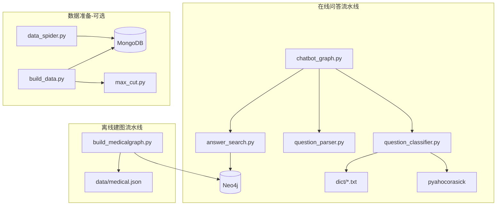
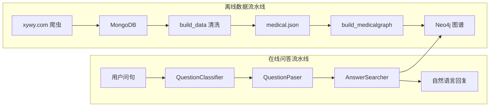
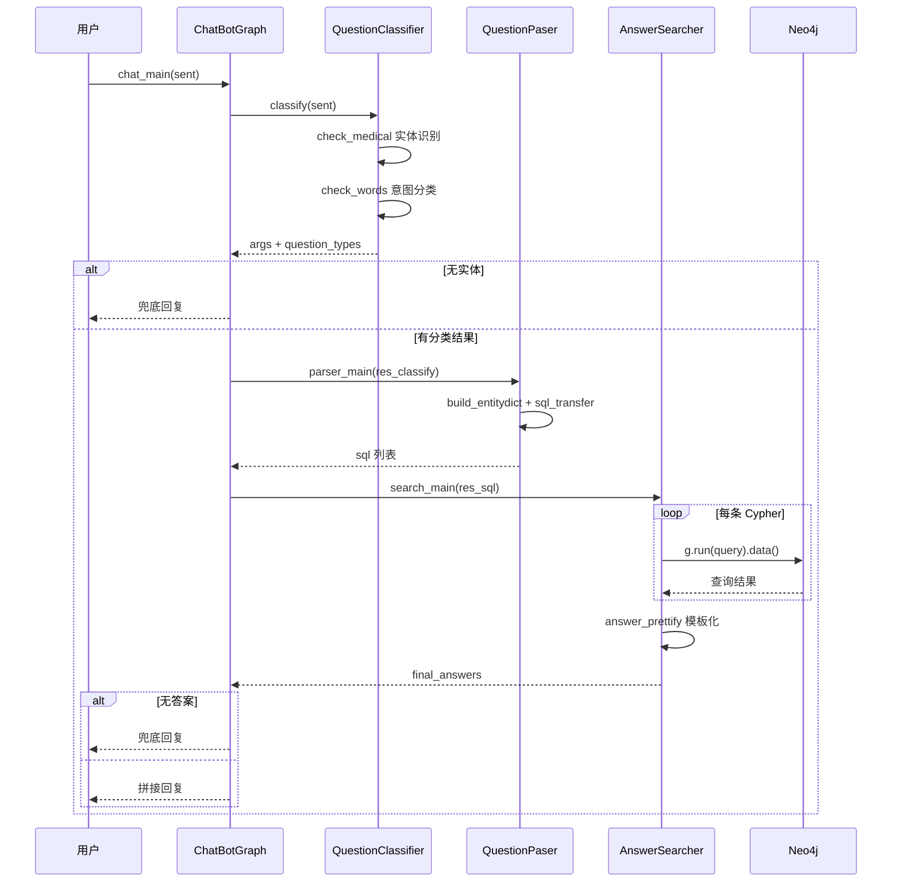

# QASystemOnMedicalKG 项目分析

> 本文档对医疗知识图谱问答系统进行结构化分析，涵盖目录结构、模块依赖、整体架构、请求流程、知识图谱 Schema、部署路径及已知局限。

---

## 1. 项目概述

### 1.1 项目目标

本项目（**QASystemOnMedicalKG**）源自刘焕勇的 [QABasedOnMedicalKnowledgeGraph](https://github.com/liuhuanyong/QABasedOnMedicalKnowledgeGraph)，目标是从零搭建一个**以疾病为中心**的医药领域知识图谱，并基于该图谱提供自动问答服务。

- **知识图谱规模**：约 4.4 万实体、30 万关系
- **问答能力**：支持 18 类医疗问句的规则驱动自动回复
- **数据来源**：垂直医药网站（寻医问药 xywy.com）结构化数据

### 1.2 技术栈

| 组件 | 技术 | 用途 |
|------|------|------|
| 语言 | Python 3 | 全部业务逻辑 |
| 图数据库 | Neo4j + py2neo | 知识图谱存储与 Cypher 查询 |
| 实体识别 | pyahocorasick（Aho-Corasick 自动机） | 问句中医疗实体快速匹配 |
| 文档数据库 | MongoDB + pymongo | 数据准备阶段（爬虫/清洗，可选） |
| HTML 解析 | lxml | 爬虫阶段页面解析（可选） |

### 1.3 入口脚本

| 脚本 | 命令 | 说明 |
|------|------|------|
| `chatbot_graph.py` | `python chatbot_graph.py` | **在线问答入口**（交互式 CLI） |
| `build_medicalgraph.py` | `python build_medicalgraph.py` | **知识图谱入库**（离线，耗时数小时） |

> **注意**：README 中写的是 `python chat_graph.py`，实际文件名为 `chatbot_graph.py`。

---

## 2. 目录结构

```
QASystemOnMedicalKG/
├── chatbot_graph.py          # 问答入口，编排三阶段流水线
├── question_classifier.py    # 问句分类：实体识别 + 意图判断
├── question_parser.py        # 问句解析：生成 Cypher 查询语句
├── answer_search.py          # 答案检索：执行 Cypher + 模板化回复
├── build_medicalgraph.py     # 图谱构建：JSON → Neo4j 节点与关系
├── data/
│   └── medical.json          # 核心数据源（8808 条疾病 JSON 记录）
├── dict/                     # 实体词典（供 Aho-Corasick 识别）
│   ├── disease.txt           # 疾病（8806 条）
│   ├── symptom.txt           # 症状（5997 条）
│   ├── drug.txt              # 药品（3827 条）
│   ├── food.txt              # 食物（4869 条）
│   ├── check.txt             # 检查项目（3352 条）
│   ├── department.txt        # 科室（53 条）
│   ├── producer.txt          # 在售药品（17200 条）
│   └── deny.txt              # 否定词（38 条，识别"忌吃"类问句）
├── prepare_data/             # 可选：从零构建数据时使用
│   ├── data_spider.py        # 爬虫：抓取 xywy.com → MongoDB
│   ├── build_data.py         # 清洗：MongoDB → 结构化字段
│   └── max_cut.py            # 词典最大匹配分词
├── img/                      # 架构图、问答截图
├── document/                 # PPT 等补充资料
├── README.md
└── doc/
    └── 项目分析.md            # 本文档
```

### 2.1 Python 源文件职责

| 文件 | 类名 | 职责 |
|------|------|------|
| `chatbot_graph.py` | `ChatBotGraph` | 串联分类 → 解析 → 检索，提供兜底回复 |
| `question_classifier.py` | `QuestionClassifier` | Aho-Corasick 实体识别 + 规则意图分类 |
| `question_parser.py` | `QuestionPaser` | 按 question_type 生成 Cypher 模板 |
| `answer_search.py` | `AnswerSearcher` | 连接 Neo4j 执行查询，模板化自然语言答案 |
| `build_medicalgraph.py` | `MedicalGraph` | 读取 medical.json，批量创建节点与关系 |
| `prepare_data/data_spider.py` | `CrimeSpider` | 爬取疾病页面写入 MongoDB |
| `prepare_data/build_data.py` | `MedicalGraph` | MongoDB 数据清洗与字段结构化 |
| `prepare_data/max_cut.py` | `CutWords` | 最大正向/反向/双向词典切分 |

---

## 3. 文件依赖关系

### 3.1 模块依赖图



### 3.2 逐文件 import 明细

| 文件 | 导入的外部模块 | 被谁导入 |
|------|---------------|----------|
| `chatbot_graph.py` | `question_classifier.*`, `question_parser.*`, `answer_search.*` | 入口（`__main__`） |
| `question_classifier.py` | `os`, `ahocorasick` | `chatbot_graph.py` |
| `question_parser.py` | 无 | `chatbot_graph.py` |
| `answer_search.py` | `py2neo.Graph` | `chatbot_graph.py` |
| `build_medicalgraph.py` | `os`, `json`, `py2neo.Graph, Node` | 独立入口 |
| `prepare_data/data_spider.py` | `urllib`, `lxml`, `pymongo`, `re` | 独立 |
| `prepare_data/build_data.py` | `pymongo`, `lxml`, `os`, `max_cut.*` | 独立 |
| `prepare_data/max_cut.py` | 无 | `build_data.py` |

### 3.3 关键依赖说明

1. **星形编排**：QA 三模块（classifier / parser / searcher）**互不 import**，仅由 `chatbot_graph.py` 统一调用。
2. **分类器无数据库依赖**：`question_classifier.py` 启动时加载 `dict/` 下 8 个词典文件，构建 Aho-Corasick 自动机，运行时纯内存操作。
3. **Neo4j 连接硬编码**：`answer_search.py` 与 `build_medicalgraph.py` 均使用相同连接参数（`127.0.0.1:7474`, user=`lhy`, password=`lhy123`）。
4. **流水线隔离**：`prepare_data/` 与在线 QA 链**无交叉 import**；爬虫用 MongoDB，建图用 Neo4j，QA 运行时只访问 Neo4j + dict。

---

## 4. 整体架构

### 4.1 双流水线架构

项目分为两条独立的数据流水线：



### 4.2 在线问答三层架构

| 层次 | 模块 | 核心类/方法 | 职责 |
|------|------|------------|------|
| 入口层 | `chatbot_graph.py` | `ChatBotGraph.chat_main()` | 串联三阶段，无实体/无答案时返回兜底文案 |
| NLU 层 | `question_classifier.py` | `QuestionClassifier.classify()` | Aho-Corasick 实体识别 + 疑问词规则匹配 → 18 类意图 |
| NLU 层 | `question_parser.py` | `QuestionPaser.parser_main()` | 分类结果 → Cypher 查询语句列表 |
| 检索层 | `answer_search.py` | `AnswerSearcher.search_main()` | 执行 Cypher，按类型套自然语言模板（最多 20 条） |

### 4.3 离线建图流程

```
medical.json
  → MedicalGraph.read_nodes()       # 解析 JSON，收集节点实体 + 关系边 + 疾病属性
  → MedicalGraph.create_graphnodes() # 创建 Disease（含属性）+ Drug/Food/Check/...
  → MedicalGraph.create_graphrels()  # 创建 11 种关系边
  → Neo4j 图数据库
```

### 4.4 核心入口代码

问答主流程在 `ChatBotGraph.chat_main()` 中实现：

```python
def chat_main(self, sent):
    answer = '您好，我是小勇医药智能助理...'  # 兜底回复
    res_classify = self.classifier.classify(sent)
    if not res_classify:
        return answer
    res_sql = self.parser.parser_main(res_classify)
    final_answers = self.searcher.search_main(res_sql)
    if not final_answers:
        return answer
    else:
        return '\n'.join(final_answers)
```

---

## 5. 请求流程

### 5.1 时序图



### 5.2 阶段一：问题分类

**模块**：`question_classifier.py` → `QuestionClassifier.classify(question)`

**步骤**：

1. **`check_medical(question)`** — 用 Aho-Corasick 自动机在问句中匹配 `dict/` 词典实体，去除子串冗余（如"糖尿病"与"型糖尿病"共存时保留长词），返回 `{实体名: [类型列表]}`。
2. 若无实体 → 返回 `{}`，触发兜底。
3. **`check_words(疑问词列表, question)`** — 子串匹配 12 组疑问词（症状、原因、并发症、饮食、药品、检查、预防、周期、治疗方式、治愈概率、易感人群等），结合实体类型推断 `question_types`（可多个）。
4. 兜底规则：仅有 disease 实体且无其他匹配 → `disease_desc`；仅有 symptom → `symptom_disease`。

**输出格式**：

```python
{
    'args': {'糖尿病': ['disease'], ...},
    'question_types': ['disease_symptom', ...]
}
```

### 5.3 阶段二：Cypher 生成

**模块**：`question_parser.py` → `QuestionPaser.parser_main(res_classify)`

**步骤**：

1. **`build_entitydict(args)`** — 将 `{实体: [类型]}` 反转为 `{类型: [实体列表]}`。
2. 对每个 `question_type` 调用 **`sql_transfer(question_type, entities)`**，按类型生成 Cypher 字符串列表。
3. 返回 `[{'question_type': '...', 'sql': ['MATCH ...', ...]}, ...]`。

### 5.4 阶段三：查询与格式化

**模块**：`answer_search.py` → `AnswerSearcher.search_main(sqls)`

**步骤**：

1. 遍历每个 `sql_`，对其 `sql` 列表逐条执行 `self.g.run(query).data()`。
2. 合并结果后调用 **`answer_prettify(question_type, answers)`**，按类型套自然语言模板。
3. 每条答案最多展示 `num_limit=20` 条结果，去重后以 `；` 分隔。

### 5.5 端到端示例

**用户输入**：`"糖尿病有什么症状"`

```
chatbot_graph.py :: ChatBotGraph.chat_main
  │
  ├─ question_classifier.py :: QuestionClassifier.classify
  │    ├─ check_medical("糖尿病有什么症状")
  │    │    → {'糖尿病': ['disease']}
  │    └─ check_words(symptom_qwds, ...) → True
  │         → question_types: ['disease_symptom']
  │
  ├─ question_parser.py :: QuestionPaser.parser_main
  │    └─ sql_transfer('disease_symptom', ['糖尿病'])
  │         → ["MATCH (m:Disease)-[r:has_symptom]->(n:Symptom)
  │              where m.name = '糖尿病' return m.name, r.name, n.name"]
  │
  └─ answer_search.py :: AnswerSearcher.search_main
       ├─ g.run(cypher).data()
       │    → [{'m.name': '糖尿病', 'r.name': '症状', 'n.name': '多饮'}, ...]
       └─ answer_prettify('disease_symptom', answers)
            → "糖尿病的症状包括：多饮；多尿；多食；..."
```

### 5.6 18 类问答对照表

| question_type | 中文含义 | 触发条件 | Cypher 模式 | 回复模板示例 |
|---------------|----------|----------|-------------|-------------|
| `disease_symptom` | 疾病症状 | 症状词 + disease 实体 | `Disease -[has_symptom]-> Symptom` | `{疾病}的症状包括：{症状列表}` |
| `symptom_disease` | 症状查病 | 症状词 + symptom 实体 | `Disease -[has_symptom]-> Symptom`（反向） | `症状{症状}可能染上的疾病有：{疾病列表}` |
| `disease_cause` | 疾病病因 | 原因词 + disease | `MATCH (m:Disease) return m.cause` | `{疾病}可能的成因有：{原因}` |
| `disease_acompany` | 并发症 | 并发症词 + disease | `Disease -[acompany_with]-> Disease`（双向） | `{疾病}的症状包括：{并发疾病列表}` |
| `disease_not_food` | 忌口食物 | 饮食词 + 否定词 + disease | `Disease -[no_eat]-> Food` | `{疾病}忌食的食物包括有：{食物列表}` |
| `disease_do_food` | 宜食/推荐食谱 | 饮食词 + disease（无否定） | `do_eat` + `recommand_eat` | `{疾病}宜食的食物包括有：...\n推荐食谱包括有：...` |
| `food_not_disease` | 某食物不宜什么病 | 饮食/治疗词 + 否定 + food | `Disease -[no_eat]-> Food`（反向） | `患有{疾病列表}的人最好不要吃{食物}` |
| `food_do_disease` | 某食物对什么病好 | 饮食/治疗词 + food | `do_eat` + `recommand_eat`（反向） | `患有{疾病列表}的人建议多试试{食物}` |
| `disease_drug` | 疾病用什么药 | 药品词 + disease | `common_drug` + `recommand_drug` | `{疾病}通常的使用的药品包括：{药品列表}` |
| `drug_disease` | 药品治什么病 | 治疗词 + drug | `common_drug` + `recommand_drug`（反向） | `{药品}主治的疾病有{疾病列表},可以试试` |
| `disease_check` | 疾病做什么检查 | 检查词 + disease | `Disease -[need_check]-> Check` | `{疾病}通常可以通过以下方式检查出来：{检查列表}` |
| `check_disease` | 检查能查什么病 | 检查/治疗词 + check | `need_check`（反向） | `通常可以通过{检查}检查出来的疾病有{疾病列表}` |
| `disease_prevent` | 预防措施 | 预防词 + disease | `MATCH (m:Disease) return m.prevent` | `{疾病}的预防措施包括：{措施}` |
| `disease_lasttime` | 治疗周期 | 周期词 + disease | `MATCH (m:Disease) return m.cure_lasttime` | `{疾病}治疗可能持续的周期为：{周期}` |
| `disease_cureway` | 治疗方式 | 治疗方式词 + disease | `MATCH (m:Disease) return m.cure_way` | `{疾病}可以尝试如下治疗：{方式列表}` |
| `disease_cureprob` | 治愈概率 | 治愈概率词 + disease | `MATCH (m:Disease) return m.cured_prob` | `{疾病}治愈的概率为（仅供参考）：{概率}` |
| `disease_easyget` | 易感人群 | 易感人群词 + disease | `MATCH (m:Disease) return m.easy_get` | `{疾病}的易感人群包括：{人群}` |
| `disease_desc` | 疾病描述 | 仅有 disease、无其他匹配 | `MATCH (m:Disease) return m.desc` | `{疾病},熟悉一下：{描述}` |

---

## 6. 知识图谱 Schema

### 6.1 节点类型（7 类）

| Label | 中文 | 数量 | 属性 |
|-------|------|------|------|
| `Disease` | 疾病 | 8,807 | name, desc, prevent, cause, easy_get, cure_lasttime, cure_way, cured_prob, cure_department |
| `Symptom` | 症状 | 5,998 | name |
| `Drug` | 药品 | 3,828 | name |
| `Food` | 食物 | 4,870 | name |
| `Check` | 检查项目 | 3,353 | name |
| `Department` | 科室 | 54 | name |
| `Producer` | 在售药品 | 17,201 | name |
| **合计** | | **44,111** | |

### 6.2 关系类型（11 类）

| 关系类型 | 中文 | 起点 → 终点 | rel.name | 数量 |
|----------|------|-------------|----------|------|
| `has_symptom` | 疾病症状 | Disease → Symptom | 症状 | 5,998 |
| `acompany_with` | 并发症 | Disease → Disease | 并发症 | 12,029 |
| `no_eat` | 忌吃 | Disease → Food | 忌吃 | 22,247 |
| `do_eat` | 宜吃 | Disease → Food | 宜吃 | 22,238 |
| `recommand_eat` | 推荐食谱 | Disease → Food | 推荐食谱 | 40,221 |
| `common_drug` | 常用药品 | Disease → Drug | 常用药品 | 14,649 |
| `recommand_drug` | 好评药品 | Disease → Drug | 好评药品 | 59,467 |
| `need_check` | 诊断检查 | Disease → Check | 诊断检查 | 39,422 |
| `belongs_to` | 属于/所属科室 | Department → Department 或 Disease → Department | 属于 / 所属科室 | 8,844 |
| `drugs_of` | 生产药品 | Producer → Drug | 生产药品 | 17,315 |
| **合计** | | | | **294,149** |

### 6.3 数据来源字段映射

`medical.json` 每行一条疾病记录，主要字段与图谱映射关系：

| JSON 字段 | 图谱映射 |
|-----------|----------|
| `name` | Disease 节点 name |
| `desc`, `prevent`, `cause`, `easy_get`, `cure_lasttime`, `cure_way`, `cured_prob` | Disease 节点属性 |
| `symptom` | Symptom 节点 + has_symptom 关系 |
| `acompany` | Disease 节点 + acompany_with 关系 |
| `not_eat`, `do_eat`, `recommand_eat` | Food 节点 + no_eat/do_eat/recommand_eat 关系 |
| `common_drug`, `recommand_drug` | Drug 节点 + common_drug/recommand_drug 关系 |
| `check` | Check 节点 + need_check 关系 |
| `cure_department` | Department 节点 + belongs_to 关系 |
| `drug_detail` | Producer 节点 + drugs_of 关系 |

---

## 7. 数据流与部署路径

### 7.1 快速部署（仓库已含数据）

适用于当前仓库已包含 `data/medical.json` 和 `dict/` 词典的情况：

```
1. 安装 Neo4j，修改 answer_search.py 和 build_medicalgraph.py 中的连接凭据
2. pip install py2neo pyahocorasick
3. python build_medicalgraph.py     # 导入图谱（数小时）
4. python chatbot_graph.py          # 启动交互问答
```

### 7.2 从零构建（可选）

需要额外安装 MongoDB 并运行数据准备脚本：

```
1. python prepare_data/data_spider.py   # 爬取 xywy.com → MongoDB
2. python prepare_data/build_data.py    # MongoDB 清洗 → medical 集合
3. 导出 medical.json
4. python build_medicalgraph.py         # JSON → Neo4j
5. python chatbot_graph.py              # 启动问答
```

### 7.3 词典与图谱一致性

- `dict/` 词典用于问句实体识别，需与 Neo4j 图谱中的实体名保持一致。
- 可通过 `build_medicalgraph.py` 的 `export_data()` 方法从图谱导出实体名生成词典。

---

## 8. 外部依赖与配置

### 8.1 Python 依赖

项目无 `requirements.txt`，根据代码 import 推断：

```bash
# 在线问答 + 建图（必需）
pip install py2neo pyahocorasick

# 数据准备阶段（可选）
pip install pymongo lxml
```

### 8.2 Neo4j 配置

以下两个文件中硬编码了连接参数，部署前需修改为实际值：

| 文件 | 配置项 |
|------|--------|
| `answer_search.py` L11-15 | host, http_port, user, password |
| `build_medicalgraph.py` L15-19 | host, http_port, user, password |

默认值：`127.0.0.1:7474`, user=`lhy`, password=`lhy123`

### 8.3 MongoDB 配置（仅数据准备）

| 文件 | 配置 |
|------|------|
| `prepare_data/data_spider.py` | localhost, 库 `medical`, 集合 `data` / `jc` |
| `prepare_data/build_data.py` | 同上 |

---

## 9. 已知局限

1. **规则驱动，无语义理解**：基于 Aho-Corasick 词典匹配 + 疑问词规则，无法理解同义改写或未收录实体。
2. **大段文本未结构化**：病因（`disease_cause`）、预防（`disease_prevent`）、描述（`disease_desc`）等返回 Disease 节点的长文本属性，未做事件抽取或结构化表示。
3. **路径硬编码**：`question_classifier.py` 使用 `os.path.abspath(__file__)` 拼接 dict 路径，跨平台部署需注意路径分隔符（当前用 `/` 拼接）。
4. **无 requirements.txt**：依赖版本未锁定，不同 py2neo 版本 API 可能有差异。
5. **Cypher 注入风险**：`sql_transfer()` 直接将实体名拼入 Cypher 字符串，未做转义处理。
6. **README 入口脚本名错误**：文档写 `chat_graph.py`，实际为 `chatbot_graph.py`。
7. **prepare_data 缺失文件**：`build_data.py` 依赖 `first_name.txt`（仓库中未包含）。

---

## 10. 附录：模块核心方法速查

### ChatBotGraph（chatbot_graph.py）

| 方法 | 说明 |
|------|------|
| `__init__()` | 实例化 Classifier、Parser、Searcher |
| `chat_main(sent)` | 三阶段问答主入口 |

### QuestionClassifier（question_classifier.py）

| 方法 | 说明 |
|------|------|
| `classify(question)` | 分类主入口 |
| `check_medical(question)` | AC 自动机实体识别 + 去冗余 |
| `check_words(wds, sent)` | 疑问词子串匹配 |
| `build_actree(wordlist)` | 构建 Aho-Corasick 自动机 |
| `build_wdtype_dict()` | 词 → 类型映射 |

### QuestionPaser（question_parser.py）

| 方法 | 说明 |
|------|------|
| `parser_main(res_classify)` | 解析主入口 |
| `build_entitydict(args)` | 按实体类型分组 |
| `sql_transfer(question_type, entities)` | 18 种 Cypher 模板生成 |

### AnswerSearcher（answer_search.py）

| 方法 | 说明 |
|------|------|
| `search_main(sqls)` | 检索主入口 |
| `answer_prettify(question_type, answers)` | 18 种回复模板 |

### MedicalGraph（build_medicalgraph.py）

| 方法 | 说明 |
|------|------|
| `read_nodes()` | 解析 medical.json |
| `create_graphnodes()` | 批量创建 7 类节点 |
| `create_graphrels()` | 批量创建 11 类关系 |
| `create_relationship(...)` | 去重后逐条 CREATE 关系 |
| `export_data()` | 导出实体名到 txt 词典 |
