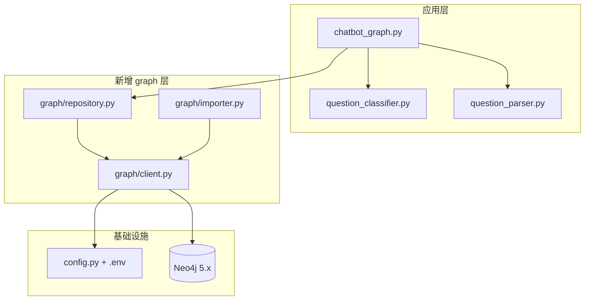

# QASystemOnMedicalKG 项目升级评估

> 评估 Python 3.6 → 3.11、py2neo → 官方驱动、Neo4j 3.5 → 最新版的升级可行性。  
> **结论：拒绝「最小兼容改动」，推荐一次性现代化重构。**

相关文档：[项目分析.md](./项目分析.md) | [启动项目.md](./启动项目.md)

---

## 1. 升级背景与结论摘要

### 1.1 当前基线

| 组件 | 原设计版本 | 当前状态 |
|------|-----------|----------|
| Python | 3.6 | 本地 venv 已用 **3.11.15** |
| py2neo | 3.x 旧 API | venv 安装 **2021.2.4**（PyPI 最终版，**已 EOL**） |
| Neo4j | 3.5 | 代码硬编码 HTTP 7474 |

### 1.2 实测：modern 环境已无法启动

在 Python 3.11 + py2neo 2021.2.4 下实例化图连接时直接报错：

```
ValueError: The following settings are not supported: {'http_port': 7474}
```

触发位置：

- [`answer_search.py`](../answer_search.py) 第 11–15 行
- [`build_medicalgraph.py`](../build_medicalgraph.py) 第 15–19 行

QA 非数据库模块（`question_classifier.py`、`question_parser.py`、`chatbot_graph.py`）在 Python 3.11 下 import **正常**。

### 1.3 结论

| 问题 | 结论 |
|------|------|
| 能否只升 Python？ | 不够，Graph 连接 API 已失效 |
| 能否继续用 py2neo？ | **不能**，库已 EOL，无安全更新，不支持 Neo4j 5.x |
| 推荐方案 | **现代化重构**：官方 `neo4j` 驱动 + 配置外置 + 批量建图 + 参数化 Cypher |

---

## 2. 为何拒绝「兼容方案」

以下做法看似改动小，但会为后续开发埋下隐患，**均不推荐**：

| 兼容做法 | 隐患 | 决策 |
|----------|------|------|
| py2neo 2021.2.4 + 仅改连接参数 | 依赖 EOL 库；Neo4j 最高可靠支持 4.4 | **拒绝** |
| py2neo + Neo4j 5.x | 非官方支持，社区大量兼容问题 | **拒绝** |
| 保留 `answer_prettify` 对 `'m.name'` 字典键 | 与 Cypher alias 强耦合，改查询即改模板 | **重构** |
| 保留 `build_medicalgraph` 逐条 `g.create()` | 30 万次网络往返，导入需数小时 | **重构为 UNWIND 批量** |
| 凭据硬编码在两个 py 文件 | 换环境必改代码，易泄露 | **外置 `.env`** |
| 无 `.gitignore` / `requirements.txt` | `.venv`、`.env` 可能误提交 | **已补 `.gitignore`** |

---

## 3. 目标技术栈

| 组件 | 目标版本 | 说明 |
|------|----------|------|
| Python | 3.11+ | 已验证 QA 模块兼容 |
| Neo4j 驱动 | `neo4j` **6.x**（官方） | 替代 py2neo，持续维护 |
| Neo4j Server | **5.x / 2025.x** | Bolt 7687，弃用 HTTP 7474 连接 |
| 配置 | `.env` + `config.py` | 凭据不入库；提供 `.env.example` |
| 依赖管理 | `requirements.txt` | 锁定版本，不含 py2neo |

---

## 4. 现代化重构架构



### 4.1 新增模块

| 模块 | 职责 | 替代 |
|------|------|------|
| `config.py` | 读取 `NEO4J_URI` / `NEO4J_USER` / `NEO4J_PASSWORD` | 两文件硬编码 |
| `graph/client.py` | `GraphDatabase.driver` 单例、session 上下文 | py2neo `Graph()` |
| `graph/repository.py` | 执行 Cypher，返回结构化结果 | `answer_search` 直连驱动 |
| `graph/importer.py` | UNWIND 批量 MERGE 节点/关系 | `g.create` + 逐条 CREATE |
| `requirements.txt` | `neo4j`, `pyahocorasick`, `python-dotenv` | 无依赖文件 |
| `.gitignore` | 忽略 venv、缓存、`.env` 等 | **已创建** |
| `.env.example` | 配置模板（无真实密码） | 待 modernization 阶段新增 |

### 4.2 需重构的现有文件

| 文件 | 级别 | 内容 |
|------|------|------|
| `answer_search.py` | **重构** | 调用 `graph/repository`；`answer_prettify` 用 dataclass，去掉 `'m.name'` 魔法键 |
| `build_medicalgraph.py` | **重构** | 瘦身为 CLI，逻辑迁入 `graph/importer.py` |
| `question_parser.py` | **小改** | Cypher 用 `$name` 参数，不再 `format(i)` 拼接 |
| `question_classifier.py` | **小改** | `os.path.join` 替代 `'/'` 路径拼接 |
| `chatbot_graph.py` | **小改** | 可选 logging、常量提取 |
| `prepare_data/*` | 不改 | MongoDB 链路与 Neo4j 无关 |

### 4.3 可保留不动

- Aho-Corasick 实体识别 + 18 类规则分类
- 问句 → question_type → Cypher 映射关系
- `dict/` 词典与 `data/medical.json` 数据格式

---

## 5. API 迁移对照

| 旧写法（py2neo） | 新写法（现代化） |
|-----------------|-----------------|
| `Graph(host=, http_port=7474, user=, password=)` | `GraphDatabase.driver(os.environ["NEO4J_URI"], auth=(u,p))` |
| `g.run(cypher).data()` | `repository.execute(cypher, params)` |
| `Node("Disease", name=x)` + `g.create(node)` | `importer.merge_nodes("Disease", batch)` via UNWIND |
| `"WHERE m.name = '{0}'".format(entity)` | `"WHERE m.name = $name"` + `{"name": entity}` |
| `answer_prettify` 读 `i['m.name']` | `AnswerRecord(subject=..., items=[...])` |

**明确不做**：py2neo fallback adapter、保留旧连接注释块、双驱动并存。

---

## 6. 分项评估

### 6.1 Python 3.6 → 3.11

| 维度 | 评估 |
|------|------|
| 可行性 | **高** — 无 3.6 专属语法 |
| 需改文件 | QA 算法层 **0 个**；附带 `os.path.join` 等小改 |
| 风险 | **低** |
| 工作量 | **0.5 人日**（回归测试） |

### 6.2 py2neo → neo4j 官方驱动 6.x

| 维度 | 评估 |
|------|------|
| 可行性 | **高** — Neo4j 官方维护，支持 Python 3.11 |
| py2neo 2021.2.4 | PyPI 最终版，**2023 年宣布 EOL**，不兼容 Neo4j 5 |
| 风险 | **中**（重构面大于改连接，但无 EOL 后患） |
| 工作量 | **2–3 人日**（含 graph 层 + 问答/建图重构） |

### 6.3 Neo4j 3.5 → 5.x / 最新

| 维度 | 评估 |
|------|------|
| 可行性 | **高**（配合官方驱动） |
| 数据迁移 | 无法原地升级，需清空后重新导入 |
| Cypher | 现有 MATCH/CREATE/RETURN 基本兼容 |
| 配置 | 默认用户 `neo4j`；Bolt **7687** |
| 导入耗时 | UNWIND 批量后预计 **< 30 分钟**（旧方案数小时） |
| 风险 | **中** |
| 工作量 | **0.5 人日**（部署）+ 导入时间 |

---

## 7. 需修改文件清单

| 文件 | 改动 | 风险 |
|------|------|------|
| `answer_search.py` | 重构 | 中 |
| `build_medicalgraph.py` | 重构 | 高 |
| `question_parser.py` | 参数化 Cypher | 低 |
| `question_classifier.py` | 路径修复 | 低 |
| `graph/client.py` | **新增** | 低 |
| `graph/repository.py` | **新增** | 中 |
| `graph/importer.py` | **新增** | 高 |
| `config.py` | **新增** | 低 |
| `requirements.txt` | **新增** | 低 |
| `.env.example` | **新增** | 低 |
| `.gitignore` | **已新增** | 低 |
| `doc/启动项目.md` | 更新版本说明 | 低 |

---

## 8. 风险矩阵

| 风险项 | 等级 | 缓解措施 |
|--------|------|----------|
| py2neo EOL 无安全补丁 | **高** | 彻底移除，换官方驱动 |
| 旧 Graph API 不可用 | **高** | 已在 3.11 复现，必须重构 |
| 重构引入问答回归 | 中 | 18 类问句 + 5 条启动文档用例 |
| 批量导入内存占用 | 低 | 分批 UNWIND（如 1000 条/批） |
| Cypher 字符串拼接 | 中 | 全面参数化 |
| `.env` 误提交 | 中 | `.gitignore` 已忽略；只提交 `.env.example` |
| 继续用 py2neo「图省事」 | **高（技术债）** | 本文档明确禁止 |

---

## 9. 分阶段实施计划


| 阶段 | 内容 | 工作量 |
|------|------|--------|
| **1 基础设施** | `.gitignore`（已完成）、`requirements.txt`、`config.py`、`.env.example`、`graph/client.py` | 0.5 天 |
| **2 建图重构** | `graph/importer.py` UNWIND 批量；瘦身 `build_medicalgraph.py` | 1.5–2 天 |
| **3 问答重构** | `graph/repository.py`；重构 `answer_search.py` + `question_parser.py` | 1–1.5 天 |
| **4 验证文档** | 回归测试、更新 `doc/启动项目.md` | 0.5 天 |
| **合计** | | **3.5–4.5 人日** |

---

## 10. 验证标准

- [ ] `pip install -r requirements.txt` 后项目源码中 **无 py2neo 依赖**
- [ ] `grep -r py2neo --include='*.py' .` 零命中（排除历史文档引用）
- [ ] `MATCH (n) RETURN count(n)` ≈ **44,111**
- [ ] `MATCH ()-[r]->() RETURN count(r)` ≈ **294,149**
- [ ] 批量导入完成时间 **< 30 分钟**
- [ ] [启动项目.md](./启动项目.md) 第 6 节 5 条测试用例全部通过
- [ ] `.venv/`、`.env` 未被 git 跟踪

---

## 11. 兼容方案对照（反面教材，勿采用）

| 路径 | 方案 | 工作量 | 为何不选 |
|------|------|--------|----------|
| A | py2neo 2021.2.4 + Neo4j 4.4 + 只改连接 | 1–2 天 | EOL 栈，6–12 个月后仍需再迁移 |
| B | py2neo + Neo4j 5.x | 1–2 天 + 调试 | 非官方支持，不稳定 |
| **C（推荐）** | 官方驱动 + 现代化重构 | 3.5–4.5 天 | 一次到位，无技术债 |

---

## 12. `.gitignore` 说明

已在仓库根目录创建 [`.gitignore`](../.gitignore)，覆盖：

| 类别 | 规则示例 |
|------|----------|
| 虚拟环境 | `.venv/`, `venv/` |
| Python 缓存 | `__pycache__/`, `*.pyc` |
| 密钥 | `.env`, `.env.local`（**不忽略** `.env.example`） |
| IDE / OS | `.idea/`, `.vscode/`, `.DS_Store` |
| 建图临时导出 | `/drug.txt`, `/disease.txt` 等 |
| Neo4j 本地数据 | `neo4j/`, `*.dump` |

**继续跟踪**：`data/medical.json`、`dict/*.txt`、`doc/*.md`。

---

## 13. 参考链接

- [Neo4j py2neo EOL 迁移指南](https://neo4j.com/blog/developer/py2neo-end-migration-guide/)
- [neo4j Python 驱动文档](https://neo4j.com/docs/api/python-driver/current/)
- [py2neo GitHub EOL 声明](https://github.com/neo4j-contrib/py2neo/issues/958)
